# LearnQuranicArabic - Architecture Documentation

## Table of Contents
1. [System Overview](#system-overview)
2. [Technology Stack](#technology-stack)
3. [System Architecture](#system-architecture)
4. [Directory Structure](#directory-structure)
5. [Component Architecture](#component-architecture)
6. [Data Flow Diagrams](#data-flow-diagrams)
7. [API Architecture](#api-architecture)
8. [Database Schema](#database-schema)
9. [Authentication Flow](#authentication-flow)
10. [Key Feature Flows](#key-feature-flows)

---

## System Overview

LearnQuranicArabic is a web application for learning Quranic Arabic through interactive study of Quranic verses. The platform provides:

- **Surah Study**: Browse and study Quranic surahs with word-by-word breakdown
- **Interactive Quizzes**: Test understanding with AI-generated quizzes
- **Grammar Tutorials**: Get contextual grammar explanations using AI
- **Progress Tracking**: Track quiz attempts and learning progress

### Core Principles
- **Server-Side Rendering**: Uses Next.js App Router for SEO and performance
- **Type Safety**: Full TypeScript implementation
- **Authentication**: Supabase Auth with Row Level Security
- **AI Integration**: Mistral AI for generating quizzes and grammar explanations
- **Arabic Text Support**: Proper RTL rendering and Arabic font support

---

## Technology Stack

### Frontend
- **Framework**: Next.js 14.2.5 (App Router)
- **UI Library**: React 18
- **Styling**: Tailwind CSS 3.3.0
- **Markdown Rendering**: react-markdown 10.1.0

### Backend
- **Runtime**: Node.js (Serverless Functions via Next.js API Routes)
- **Database**: Supabase (PostgreSQL)
- **Authentication**: Supabase Auth
- **AI Service**: Mistral AI (mistral-large-latest)

### Development Tools
- **Language**: TypeScript 5
- **Package Manager**: npm
- **Build Tool**: Next.js built-in
- **Linting**: ESLint with Next.js config

---

## System Architecture

### High-Level Architecture

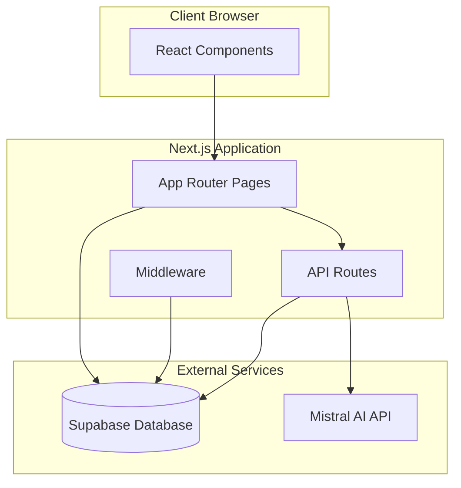

### Request Flow

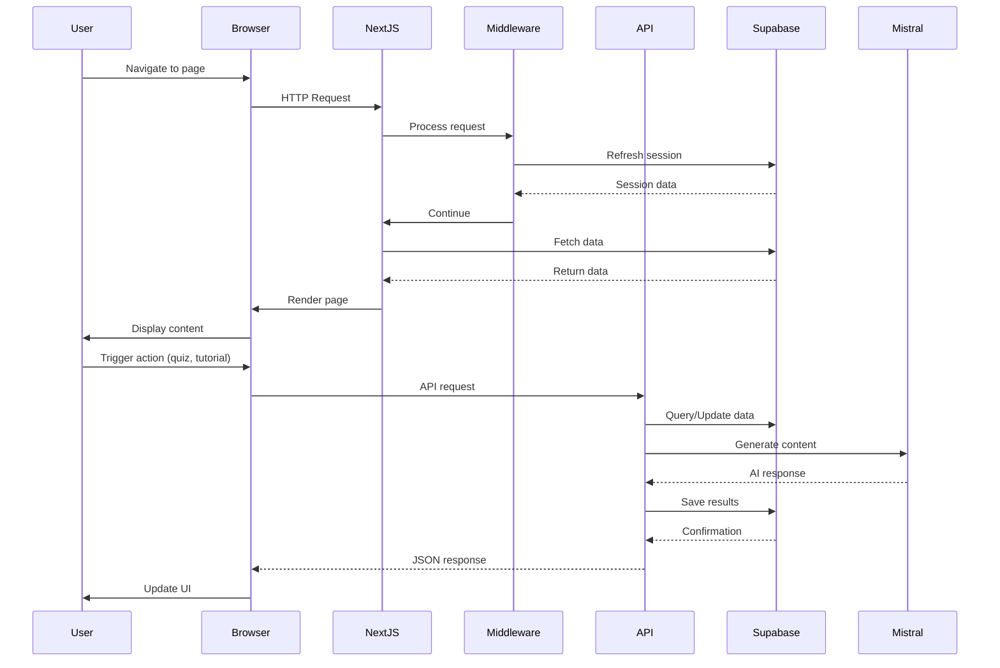

---

## Directory Structure

```
LearnQuranicArabic/
├── app/                          # Next.js App Router
│   ├── api/                      # API Routes
│   │   ├── grammar-tutorial/     # Grammar explanation API
│   │   └── quiz/                 # Quiz generation/submission
│   ├── dashboard/                # User dashboard
│   ├── login/                    # Authentication page
│   ├── quiz-history/             # Quiz history view
│   ├── surah/                    # Surah study pages
│   │   └── [id]/                 # Dynamic surah routes
│   │       ├── page.tsx          # Surah reading page
│   │       └── quiz/              # Quiz page
│   ├── layout.tsx                # Root layout
│   └── page.tsx                  # Home page
├── components/                   # React components
│   ├── ArabicText.tsx            # Arabic text renderer
│   ├── GrammarTutorialModal.tsx  # Grammar explanation modal
│   ├── LogoutButton.tsx          # Logout component
│   ├── VerseDisplay.tsx          # Verse display component
│   ├── WordDisplay.tsx           # Word display component
│   └── WordModal.tsx             # Word detail modal
├── docs/                         # Documentation
├── lib/                          # Shared libraries (if any)
├── scripts/                      # Utility scripts
├── supabase/                     # Database migrations
│   └── migrations/               # SQL migration files
├── types/                        # TypeScript type definitions
│   └── quran.ts                  # Quran data types
├── utils/                        # Utility functions
│   └── supabase/                 # Supabase client utilities
│       ├── client.ts             # Client-side Supabase
│       └── server.ts             # Server-side Supabase
├── middleware.ts                 # Next.js middleware
└── package.json                  # Dependencies
```

---

## Component Architecture

### Component Hierarchy

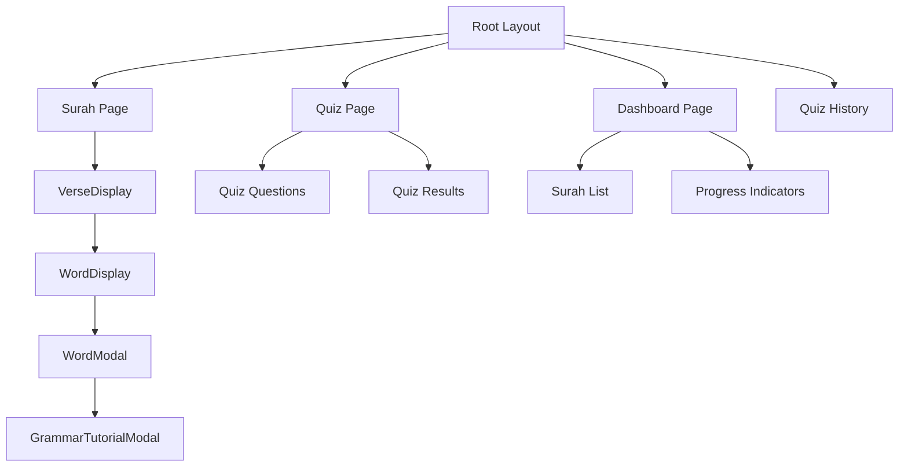

### Component Responsibilities

#### **ArabicText Component**
- Renders Arabic text with proper RTL support
- Handles different variants (word, verse, etc.)
- Applies Arabic font styling (Amiri)

#### **VerseDisplay Component**
- Displays complete verse with word-by-word breakdown
- Handles word click events
- Manages verse-level state

#### **WordDisplay Component**
- Renders individual word with styling
- Handles word selection
- Triggers WordModal on click

#### **WordModal Component**
- Shows word details (Arabic, transliteration, translation)
- Displays grammar information
- Provides link to grammar tutorial

#### **GrammarTutorialModal Component**
- Fetches AI-generated grammar explanation
- Displays formatted tutorial content
- Handles loading and error states

---

## Data Flow Diagrams

### Surah Reading Flow

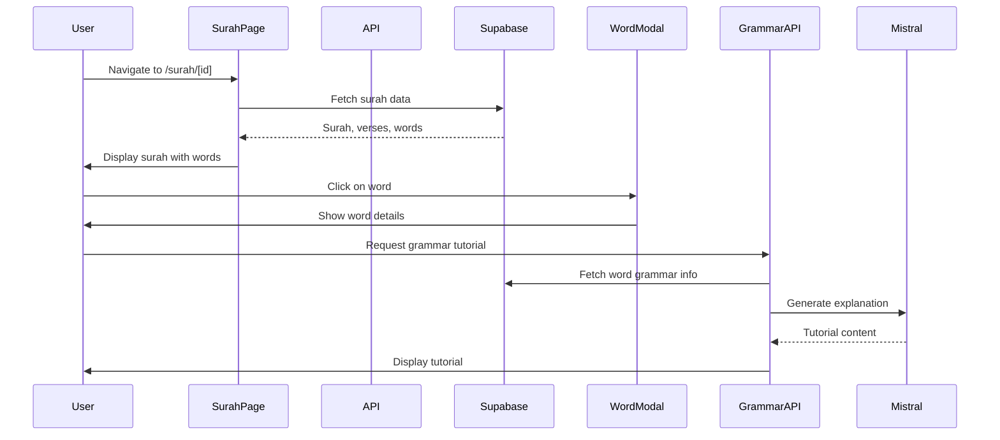

### Quiz Generation Flow

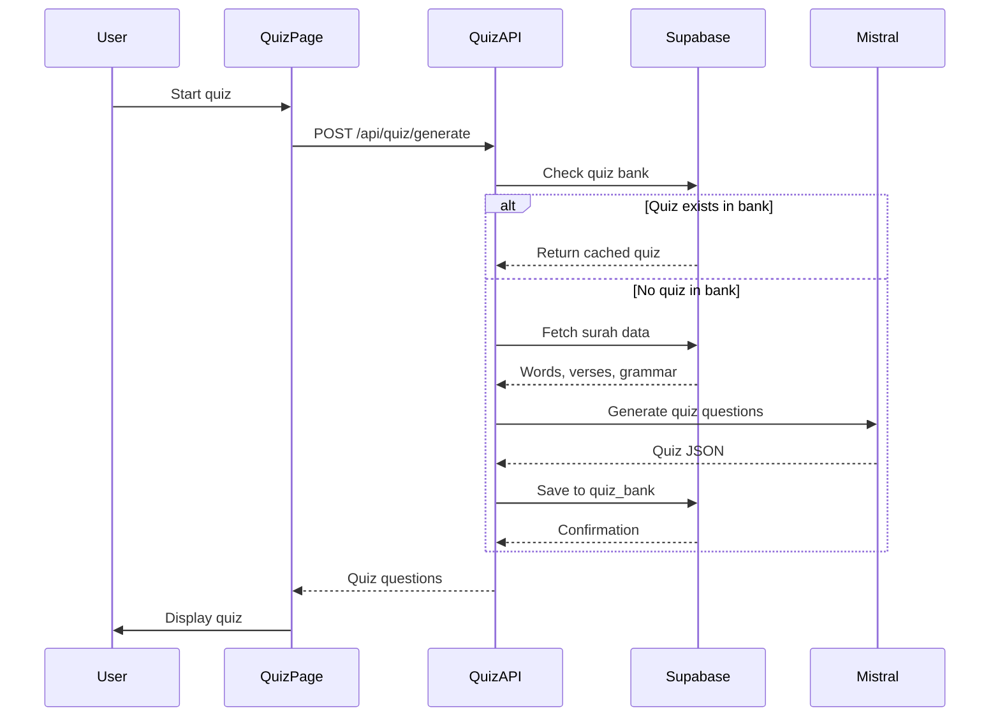

### Quiz Submission Flow

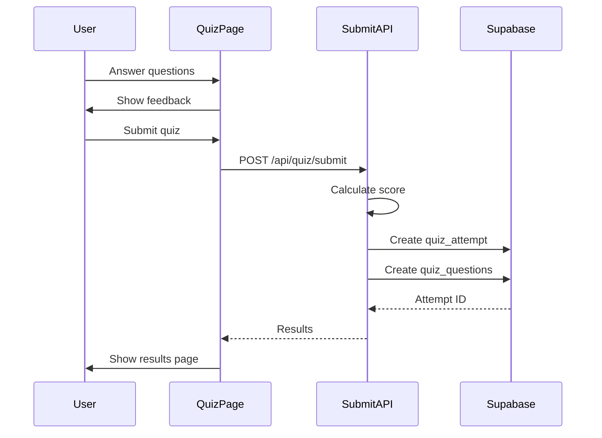

---

## API Architecture

### API Routes Structure

```
/api/
├── grammar-tutorial/
│   └── route.ts          # POST - Generate grammar explanation
└── quiz/
    ├── generate/
    │   └── route.ts      # POST - Generate quiz questions
    ├── submit/
    │   └── route.ts      # POST - Submit quiz answers
    └── check-bank/
        └── route.ts      # GET - Check for existing quiz
```

### API Endpoints

#### **POST /api/grammar-tutorial**
Generates contextual grammar explanations using Mistral AI.

**Request Body:**
```typescript
{
  arabicWord: string;
  grammarInfo: GrammarInfo;
  wordId: number;
  verseContext?: {
    text_arabic: string;
    surah_number: number;
    ayah_number: number;
  };
}
```

**Response:**
```typescript
{
  tutorial: string;  // Markdown-formatted explanation
}
```

**Flow:**
1. Validate input
2. Build prompt with grammar context
3. Call Mistral AI API
4. Process and clean response
5. Return formatted tutorial

#### **POST /api/quiz/generate**
Generates quiz questions for a surah.

**Request Body:**
```typescript
{
  surahId: number;
}
```

**Response:**
```typescript
{
  questions: QuizQuestion[];
  cached: boolean;
}
```

**Flow:**
1. Check quiz_bank for existing quiz
2. If exists, return cached quiz
3. If not, fetch surah data from database
4. Build prompt for Mistral AI
5. Generate 10 questions (4 word meaning, 3 grammar, 2 translation, 1 comprehension)
6. Save to quiz_bank
7. Return questions

#### **POST /api/quiz/submit**
Submits quiz answers and calculates score.

**Request Body:**
```typescript
{
  surahId: number;
  answers: {
    questionId: string;
    answer: string;
  }[];
}
```

**Response:**
```typescript
{
  attemptId: string;
  score: number;
  totalQuestions: number;
}
```

**Flow:**
1. Validate user authentication
2. Calculate correct answers
3. Create quiz_attempt record
4. Create quiz_question records for each answer
5. Return results

---

## Database Schema

### Entity Relationship Diagram

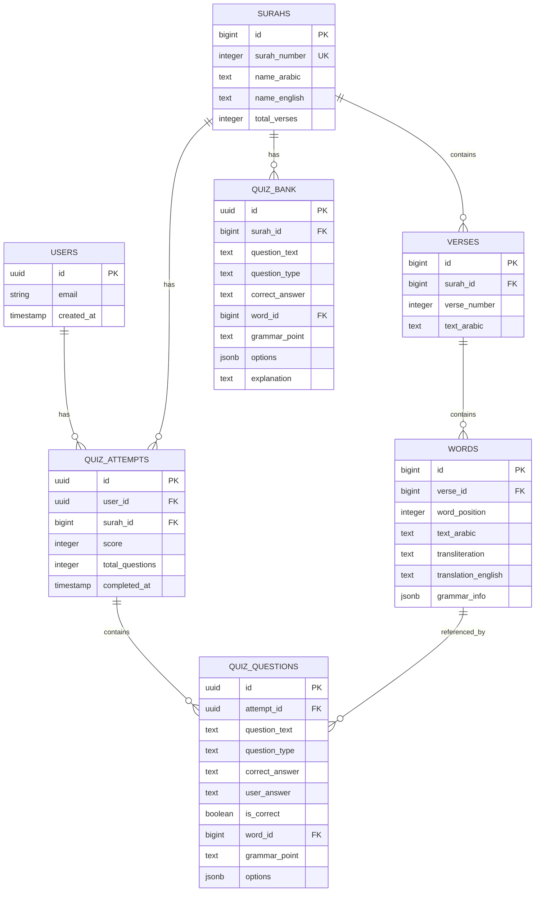

### Table Descriptions

#### **surahs**
Stores metadata for each Quranic surah (chapter).
- Primary key: `id`
- Unique constraint: `surah_number` (1-114)
- Indexed on `surah_number` for fast lookups

#### **verses**
Stores individual verses (ayahs) from each surah.
- Primary key: `id`
- Foreign key: `surah_id` → `surahs.id`
- Unique constraint: `(surah_id, verse_number)`
- Indexed on `(surah_id, verse_number)` for verse lookups

#### **words**
Stores word-by-word breakdown of verses.
- Primary key: `id`
- Foreign key: `verse_id` → `verses.id`
- Unique constraint: `(verse_id, word_position)`
- `grammar_info`: JSONB field storing grammar data
- Indexed on `verse_id` for word lookups

#### **quiz_attempts**
Tracks user quiz attempts.
- Primary key: `id` (UUID)
- Foreign keys: `user_id` → `auth.users.id`, `surah_id` → `surahs.id`
- Stores score and completion timestamp
- Indexed on `user_id` and `surah_id`

#### **quiz_questions**
Stores individual questions and answers for each attempt.
- Primary key: `id` (UUID)
- Foreign keys: `attempt_id` → `quiz_attempts.id`, `word_id` → `words.id`
- Stores question text, type, correct answer, user answer, and correctness
- `options`: JSONB array for multiple choice options

#### **quiz_bank**
Pre-generated quiz questions for each surah.
- Primary key: `id` (UUID)
- Foreign key: `surah_id` → `surahs.id`
- Unique constraint: `(surah_id, question_text)` to prevent duplicates
- Cached questions to avoid regenerating for each user

---

## Authentication Flow

### Authentication Architecture

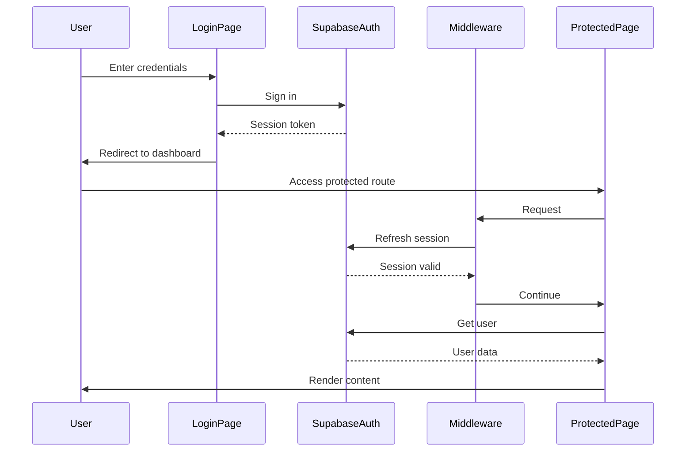

### Authentication Implementation

1. **Login Page** (`/login`)
   - Uses Supabase Auth UI or custom form
   - On success, redirects to dashboard
   - Stores session in cookies

2. **Middleware** (`middleware.ts`)
   - Runs on every request
   - Refreshes Supabase session
   - Does NOT block unauthenticated requests (handled at page level)

3. **Protected Pages**
   - Check authentication server-side
   - Redirect to `/login` if not authenticated
   - Example: `app/dashboard/page.tsx`

4. **API Routes**
   - Verify authentication in each route
   - Return 401 if not authenticated
   - Use `createClient()` from `utils/supabase/server.ts`

---

## Key Feature Flows

### Feature 1: Surah Reading

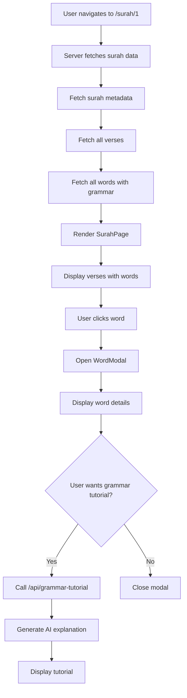

### Feature 2: Quiz Generation and Taking

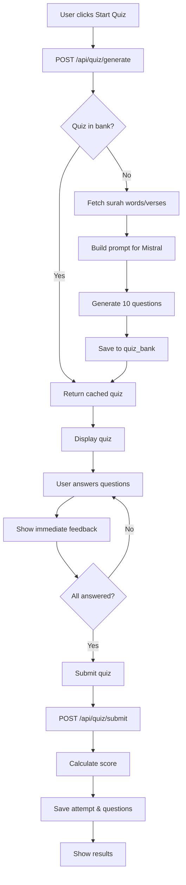

### Feature 3: Grammar Tutorial

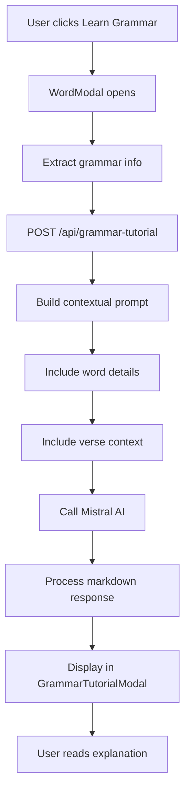

### Feature 4: Quiz History

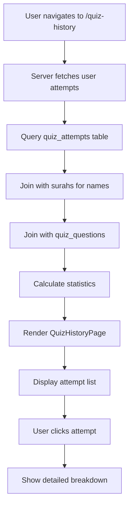

---

## Data Flow Summary

### Read Operations (Surah Data)

```
User Request → Next.js Page → Supabase Client → PostgreSQL
                                    ↓
                              Return JSON Data
                                    ↓
                              React Components
                                    ↓
                              Render to User
```

### Write Operations (Quiz Submission)

```
User Action → API Route → Validate Auth → Supabase Client
                                              ↓
                                        Insert/Update
                                              ↓
                                        PostgreSQL
                                              ↓
                                        Return Result
                                              ↓
                                        Update UI
```

### AI Generation Flow

```
User Request → API Route → Build Prompt → Mistral AI API
                                              ↓
                                        Generate Content
                                              ↓
                                        Process Response
                                              ↓
                                        Save to Database
                                              ↓
                                        Return to User
```

---

## Security Considerations

1. **Authentication**: All protected routes verify user authentication
2. **Row Level Security**: Supabase RLS policies protect user data
3. **API Keys**: Mistral API key stored in environment variables
4. **Input Validation**: All API routes validate input data
5. **SQL Injection**: Supabase client handles parameterized queries
6. **XSS Protection**: React automatically escapes user input

---

## Performance Optimizations

1. **Server-Side Rendering**: Pages rendered on server for SEO and initial load
2. **Database Indexing**: Key fields indexed for fast queries
3. **Quiz Caching**: Quiz questions cached in `quiz_bank` table
4. **Lazy Loading**: Components loaded on demand
5. **Image Optimization**: Next.js Image component for optimized images

---

## Future Enhancements

1. **Chapter Learning System**: Structured grammar learning path
2. **Vocabulary Building**: Track learned words
3. **Spaced Repetition**: Review system for retention
4. **Progress Analytics**: Detailed learning statistics
5. **Social Features**: Share progress, study groups
6. **Mobile App**: React Native version

---

## Deployment Architecture

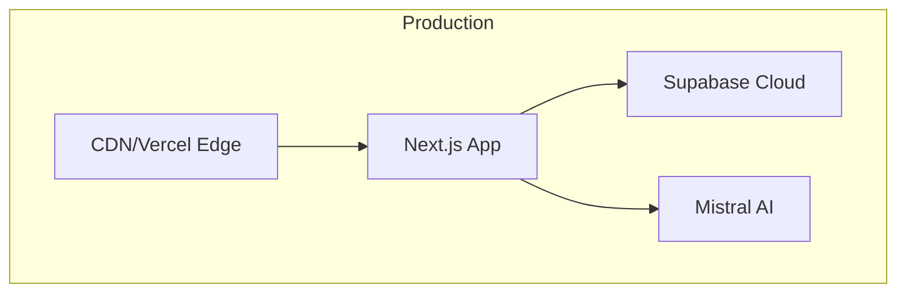

### Deployment Notes
- **Hosting**: Vercel (recommended) or similar Next.js-compatible platform
- **Database**: Supabase Cloud (managed PostgreSQL)
- **Environment Variables**: Required for Supabase and Mistral API keys
- **Build Process**: `npm run build` creates optimized production build

---

## Conclusion

This architecture provides a scalable, maintainable foundation for the LearnQuranicArabic platform. The separation of concerns, type safety, and modern React patterns ensure the codebase remains manageable as features grow.

For questions or updates to this documentation, please refer to the main README or contact the development team.

